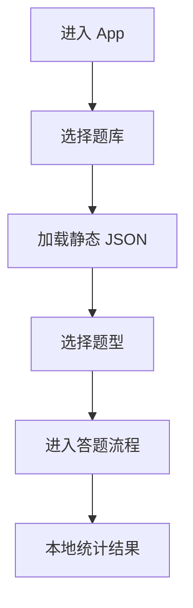

# express-redis-visitor-tracking Design

## 0. 需求摘要

为现有 React + Vite 单页题库应用增加一套独立后端访客统计能力：

- 首页显示正在访问人数
- 答题页显示正在访问人数
- 提供管理员密码保护的访客日志页
- 访客日志仅显示脱敏 IP 与粗粒度来源地（国家 / 地区 / 城市）
- 不采用 Vercel serverless，不采用 GitHub OAuth

### 成功标准

- 用户进入首页或答题页时，页面能展示来自后端共享状态的在线人数
- 同一访客的在线状态由服务端统一计算，而非前端本地推测
- 管理员通过密码登录后，可查看最近访客记录
- 普通访客无法访问管理员日志接口或日志页面

### 明确不做

- 不做毫秒级 websocket 实时在线，仅做 heartbeat + TTL 语义下的近似在线
- 不公开展示访客日志给普通用户
- 不存原始 IP
- 不引入 GitHub / 第三方 OAuth
- 不在本阶段实现复杂多角色后台

### 复杂度档位

本功能偏离当前项目默认档位：它把现有前端-only 应用扩展为“前端 SPA + 独立 Express API + Redis + 管理员 session”的跨子系统功能。虽然仍保持最小可行架构，但不属于局部 UI 增量。

## 1. 决策与约束

### 1.1 放置位置决策

现有应用没有后端层、状态共享层或认证层，所有主流程集中在 `src/App.jsx`。这次能力不应继续堆进单一大文件，而应新增两个明确边界：

1. **Node/Express API 层**：负责 presence、visitor records、管理员密码登录与 session
2. **前端 visitor 集成层**：负责 heartbeat / counts 拉取、管理员会话读取、日志 UI

前端展示仍挂接到 `App.jsx` 的主页和答题壳层，因为这两个区域是当前唯一统一的用户入口。

### 1.2 核心约束

- 在线人数必须来自服务端共享状态，不允许本地伪造
- 原始 IP 只允许在请求生命周期中读取，不落库
- 管理员权限必须在服务端判定，不能依赖前端隐藏按钮
- 所有管理员密码、session secret、Redis 凭据只能存在服务端环境变量中，不能出现在 `VITE_*`
- Presence 语义统一为：最近 `TTL` 时间窗口内发送过 heartbeat 的活动会话

### 1.3 术语约定

- **visitor**：匿名访客实体，由服务端 visitor cookie 标识
- **presence**：访客在某页面作用域下的活动状态
- **scope**：在线人数统计维度，本阶段固定为 `home` 与 `quiz`
- **admin session**：管理员密码登录后签发的服务端会话

## 2. 现状 → 变化

### 2.1 名词层（现状 → 变化）

#### 现状

- 当前仓库只有前端 SPA，`package.json` 中无后端、数据库、认证依赖
- `src/App.jsx` 自行维护刷题状态，页面切换依赖 `selectedSubject` / `selectedQuestionType`
- 当前没有可复用的 `hooks/`、`lib/`、`services/` 目录
- 当前没有 cookie/session/auth 名词，也没有访客相关领域对象

#### 变化

新增以下领域对象：

1. **VisitorIdentity**
   - `visitorId`
   - 来源：服务端设置的 HttpOnly 匿名 cookie

2. **PresenceSnapshot**
   - `scope: "home" | "quiz"`
   - `onlineCount: number`
   - `observedAt: ISO datetime`

3. **VisitorRecord**
   - `visitorId`
   - `maskedIp`
   - `country`
   - `region`
   - `city`
   - `lastScope`
   - `firstSeenAt`
   - `lastSeenAt`
   - `heartbeatCount`

4. **AdminSession**
   - `sessionId`
   - `isAdmin`
   - `createdAt`
   - 来源：管理员密码登录成功后签发的服务端 session cookie

#### 对外契约示例

`POST /api/visitors/heartbeat`

输入：

```json
{
  "scope": "home"
}
```

输出：

```json
{
  "visitorId": "anon_xxx",
  "online": {
    "home": 5,
    "quiz": 2,
    "total": 7
  }
}
```

`POST /api/admin/login`

输入：

```json
{
  "password": "***"
}
```

输出：

```json
{
  "ok": true,
  "authenticated": true
}
```

`GET /api/admin/visitors`

输出：

```json
{
  "items": [
    {
      "visitorId": "anon_xxx",
      "maskedIp": "203.0.*.*",
      "country": "CN",
      "region": "Beijing",
      "city": "Beijing",
      "lastScope": "quiz",
      "firstSeenAt": "2026-05-26T10:00:00.000Z",
      "lastSeenAt": "2026-05-26T10:02:00.000Z"
    }
  ],
  "nextCursor": null
}
```

### 2.2 编排层（现状 → 变化）

#### 现状

当前主流程只有前端本地状态流：



访客之间完全无共享状态，页面无法获知其他用户是否存在，也没有任何管理员入口。

#### 变化

新增一条并行的 visitor workflow：

```mermaid
flowchart TD
  A[用户打开 SPA] --> B{当前 scope}
  B -->|未选题库| C[home]
  B -->|已进入练习| D[quiz]
  C --> E[前端定时 heartbeat]
  D --> E
  E --> F[/api/visitors/heartbeat]
  F --> G[Redis 更新 presence zset]
  F --> H[Redis 更新 visitor record]
  F --> I[返回在线人数]
  I --> J[前端更新在线人数 UI]

  K[管理员点击日志入口] --> L[密码登录]
  L --> M[/api/admin/login]
  M --> N[建立 admin session]
  N --> O[/api/admin/visitors]
  O --> P[展示脱敏访客日志]
```

#### 主流程说明

1. SPA 根据当前 UI 状态推导 `scope`
2. 前端在页面可见时定时发送 heartbeat
3. 服务端按 `scope` 更新 Redis presence 和访客记录
4. 服务端清理超 TTL presence 后返回实时近似人数
5. 管理员通过密码登录建立 session
6. 管理员 API 仅在服务端 session 判定通过时返回访客日志

#### 流程级约束

- Heartbeat 间隔应显著小于 TTL，默认可采用 `20s / 60s`
- 页面不可见或卸载时应停止前端心跳；服务端依赖 TTL 收敛在线状态
- `counts` 接口只暴露聚合数字，不暴露 visitor records
- visitor logs 必须与 admin session 强绑定，未授权返回 `401/403`
- 管理员密码校验成功才可建立会话

### 2.3 挂载点

1. **主页壳层**：`App.jsx` 的 `if (!selectedSubject)` 分支——首页在线人数展示入口
2. **答题壳层**：`App.jsx` 主 quiz return block——答题页在线人数展示入口
3. **独立后端挂载点**：`server/src/routes/**` —— presence / admin 的统一服务端入口
4. **管理员访问入口**：前端独立 admin 视图或 admin 页面 —— 访客日志查看入口
5. **服务端环境变量挂载点**：Node 服务 env —— Redis / admin password / session secret

### 2.4 推进策略

按编排优先顺序拆成可独立验证的切片：

1. **后端基础骨架**
   - 建立 Express 目录结构、Redis 接入、公共 cookie / response / visitor helpers
   - 退出信号：本地能调用空壳 API，结构可运行

2. **Presence 编排闭环**
   - 实现 heartbeat / counts 接口与 Redis presence 语义
   - 退出信号：服务端可返回稳定的 `home/quiz/total` 在线人数

3. **管理员鉴权编排闭环**
   - 实现管理员密码登录、session 读取与退出
   - 退出信号：正确密码可建立 session，未授权用户被拒绝

4. **访客日志闭环**
   - 实现 visitor record 更新与 admin visitors API
   - 退出信号：管理员可读取脱敏访客日志，普通用户不可读

5. **前端集成与展示闭环**
   - 接入在线人数 UI 与管理员日志 UI
   - 退出信号：首页/答题页能显示在线人数，管理员页能读取日志

6. **本地开发与验证闭环**
   - 补齐 env example、代理配置、README 和验证命令
   - 退出信号：本地能同时启动前后端并完成基础 smoke test

### 2.5 结构健康度与微重构

#### 文件级评估

- `src/App.jsx` 已超过 900 行，且承担了题库选择、答题状态、结果统计、各题型分支等多重职责。继续把 visitor heartbeat、在线人数获取、管理员日志 UI 直接塞进去，会把它进一步推向“单文件应用壳 + 业务全集合”，不健康。
- 新增管理员日志和在线人数逻辑不属于现有刷题主流程的自然延伸，而是新的“访客基础设施”能力。

#### 目录级评估

- 当前 `src/` 下没有 `hooks/`、`services/` 目录，说明共享逻辑尚未成型。
- 当前项目也没有 `server/` 目录，需要新增明确后端边界。

#### 结论

**做微重构（拆文件 + 目录扩展）**。

本次不是重构旧业务语义，而是通过新增结构把新能力放到正确位置，避免继续堆胖 `App.jsx`：

- 新增 `src/hooks/`：放 visitor presence hook
- 新增 `src/services/`：放前端 API client
- 新增 `src/components/` 下的 visitor/admin 组件
- 新增 `server/src/`：放 Express app、routes、services、middleware

验证行为不变的方式：

- 旧刷题流程的核心交互不应改变
- 新增结构只承接新能力，不修改题库/判题语义
- 通过构建、诊断和 smoke test 确认旧页面仍可进入和答题

#### 建议沉淀的 convention

如果本次实现落地后稳定，建议后续把“前端共享逻辑默认落到 `src/hooks` / `src/services`，后端逻辑统一落到 `server/src/`”沉淀为项目 convention，而不是继续让 `App.jsx` 承接所有新能力。

#### 超出范围的观察

- `App.jsx` 本体过大这一现状值得后续走 `cs-refactor` 单独处理，但不把“全面拆 App.jsx”作为本 feature 前置依赖。

## 3. 验收契约

### 3.1 正常场景

1. **首页在线人数**
   - 输入 / 触发：用户打开首页
   - 期望结果：页面显示 `home` 在线人数，且数值来自后端接口

2. **答题页在线人数**
   - 输入 / 触发：用户进入任意题库并开始练习
   - 期望结果：页面显示 `quiz` 在线人数，且切换到答题页后心跳作用域从 `home` 切换到 `quiz`

3. **管理员登录成功后查看日志**
   - 输入 / 触发：管理员输入正确密码并访问管理员页面
   - 期望结果：页面显示最近访客日志，内容包含脱敏 IP 和来源地

### 3.2 边界场景

4. **页面关闭 / 不可见后在线人数收敛**
   - 输入 / 触发：用户关闭标签页或停止心跳
   - 期望结果：超过 TTL 后在线人数下降，不长期虚高

5. **同一访客重复 heartbeat**
   - 输入 / 触发：同一访客多次发送 heartbeat
   - 期望结果：在线人数不因同一 visitor 的重复心跳而无限增长

6. **无日志时管理员访问**
   - 输入 / 触发：管理员首次进入日志页但暂无访客记录
   - 期望结果：页面显示空状态，而非报错

### 3.3 错误场景

7. **未登录访问管理员 API**
   - 输入 / 触发：普通用户请求 `/api/admin/visitors`
   - 期望结果：返回 `401` 或 `403`

8. **密码错误登录**
   - 输入 / 触发：管理员登录页提交错误密码
   - 期望结果：不会建立管理员会话，并返回清晰错误

9. **Redis / env 缺失**
   - 输入 / 触发：缺少必要环境变量时启动或调用 API
   - 期望结果：接口返回清晰错误，不静默伪造人数

### 3.4 反向核对（明确不做）

10. **不暴露原始 IP**
    - 输入 / 触发：管理员读取访客日志
    - 期望结果：只能看到脱敏 IP，不能看到原始 IP

11. **不对普通访客展示访客日志**
    - 输入 / 触发：普通用户使用首页或答题页
    - 期望结果：只能看到在线人数，不能看到 IP 记录

12. **不使用前端本地值伪造在线人数**
    - 输入 / 触发：断开后端接口或未配置后端
    - 期望结果：显示错误/不可用状态，而不是随机数或本地估算值

## 4. 对 architecture / requirements 的后续影响

### 4.1 architecture 影响

本 feature 完成后，建议回写至少一份架构文档，说明：

- SPA 与 `server/src/routes/**` 的边界
- Redis presence / visitor record 数据模型
- 管理员密码会话与前端管理页的关系

### 4.2 requirements 影响

这是新能力，不是纯重构。后续应补一份 requirement，描述：

- 网站能展示在线访客活跃度
- 管理员可安全查看访客来源概览
- 访客隐私通过 IP 脱敏和后台隔离得到保护
